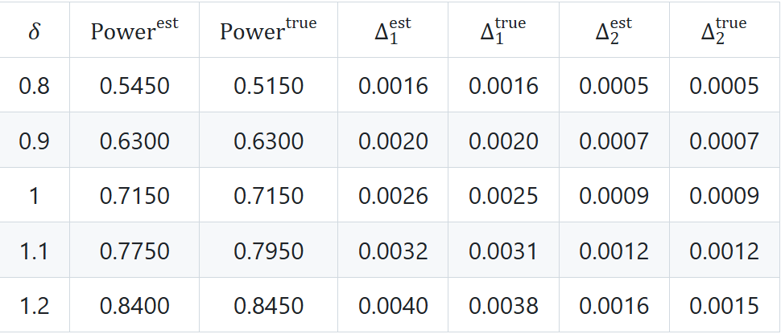
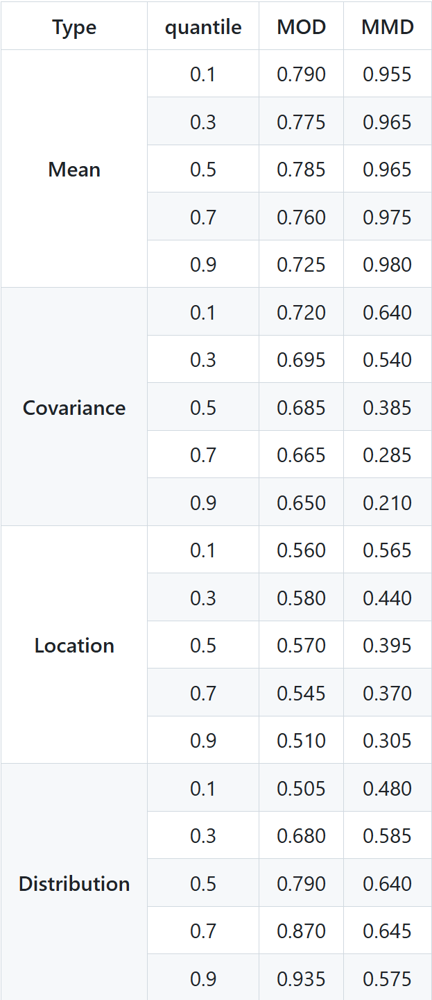
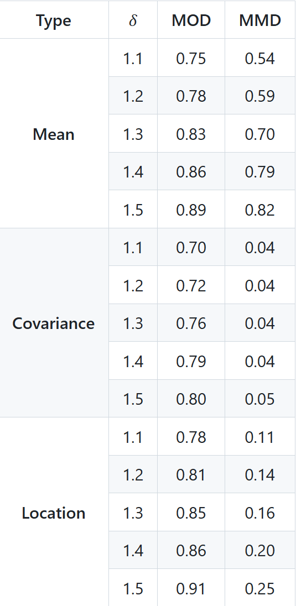

**Table 1. Power Comparison under two covariance matrices.**

**Table 2. Power comparison between MOD and MMD under different bandwidths.**

**Table 3. Power comparison of MOD and MMD for a modified version of Experiment III...**

**Figure C.1. Histograms of for $T_i$ and $T_i^2$ for one replication.**

